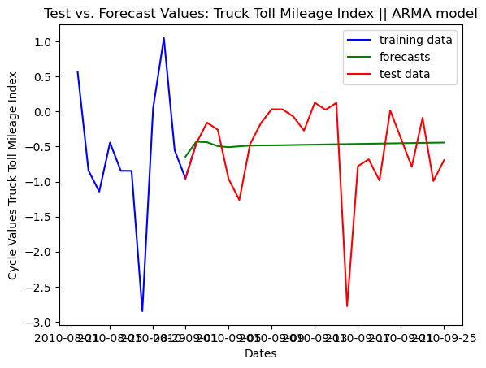
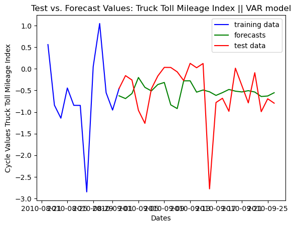
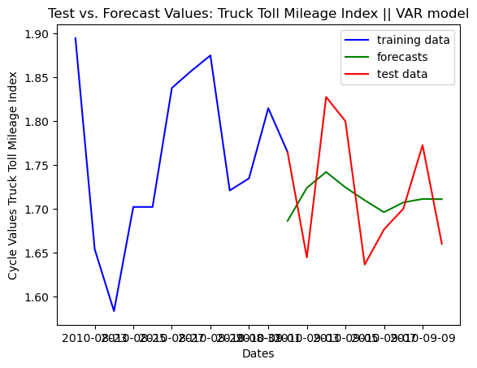
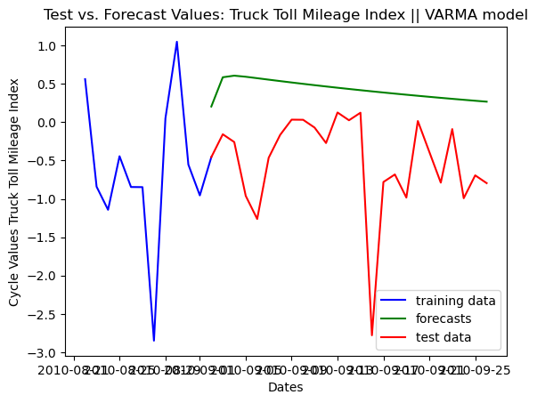
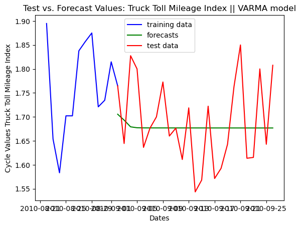

[](https://classroom.github.com/a/R1vgPUT1)

# Forecasting economic activity using a text-classification model

***Project by Fabian Schmidt***

In this project, I'm trying to improve forecasts of economic activity in the short-run using a text-classification or more specifically sentiment analysis model using newspaper headlines. The goal of this project is to see if a text-classification model can improve forecasts from standard econometric models (e.g. autoregressive models) in the short-run by adding a measure of sentiment to the analysis. 
A secondary goal is to analyze how much data is needed, what kind of data is most useful and which model one should pick, and how much tuning needs to be done to forecast short-run economic activity using newspaper headlines.
The evaluation of these questions will be documented in this README file after completion of the project.

This README file is structured like the following:
1. The structure of the repository will be explained.
2. The idea behind the project will be swiftly explained and similar research that influenced the choice of the project will be mentioned and briefly summarized.
3. The setup of the project will be documented. Datasets and the issue with getting this data will be discussed. The used model and methods to analyze the sentiment of the headlines will be presented.
4. The results of this project will be presented and discussed.
5. The questions given by the instructor of the course (Dr. Janos Gabler) will be listed and answered.

## Structure of this Repository

This repository contains three folders and 4 additional files, one of which is this README.md file.

The first file that I want to highlight is the final_project_env_windows.yml file which contains the environment that is needed to run the code from this repository. This environment has to be created and then activated for all the codes to run without causing errors. The environment file contains comments that highlight for which tasks all the libraries and modules are used.

The second and main file of this repository is the jupyter notebook called FinalprojectMain.ipynb. This notebook contains all the code that is necessary to run this project. All other files, besides these first two, that are contained in this repository will either be imported into or used in the notebook or will be exported from the notebook into the repository. The documentation of the notebook and instructions on how to run the notebook can be found in the notebook itself. To the notebook also belongs the .ipynb_checkpoints folder which contains the latest checkpoints that were either made manually or automatically during the coding process. 

The third file of this repository is the chromedriver.exe file that is used for the webscraping part of the project. A browser driver has to be used for webscraping to launch the browser, crawl through websites, and locate and scrape the data that is needed for this project. The site from which the chromedriver was downloaded can be found [here](https://chromedriver.chromium.org/downloads). You might need to either download the chrome browser if you do not have it already or update your chrome browser or download a different chromedriver based on the chrome browser version that you are using. The version that I was using is version 116.0.5845.141.

The other two folders in this repository are the data and the results folder. The data folder contains the truck toll mileage index (in German "Lkw-Maut-Fahrleistungsindex-Daten") that I use as a measure of economic activity. The data as well as further documentation related to this index can be found on the website of the German Federal Statistical Office (destatis) [here](https://www.destatis.de/EN/Service/EXSTAT/Datensaetze/truck-toll-mileage.html). Furthermore, the data folder contains the webscraped headlines that I webscraped from the German newspaper "Die Welt". They only contain headlines that were categorized by the newspaper into the categories "Economics", "Politics", and "Finance". All the other fils of this folder are either "checkpoint" files that make it possible to skip certain sections of the code or files that contain the newspaper headlines that were scraped, however, these headlines are hand-labeled and are used to test how well the used sentiment analysis model is able to classify the sentiments of the headlines, but also to fine-tune the model.
The results folder of this repository contains the graphs and images produced as a result of completing this project. These graphs will be presented and explained in the results section of this README.

## The Idea behind the Project

In this section of the README, I will discuss the idea behind this project as well as mention a couple of similar research projects that were influential in my choice of this project. This section has by no means the ambition to provide a complete overview of all the literature similar to this project, but is rather a history of thought behind the project.

The idea behind this project is to see if text-classification machine learning models can improve forecasting of economic relevant variables. Such an improvement is desirable since an improvement in forecasts can lead to better information availability and, therefore, improve decision-making by firms, households, institutions, and governments. The traditional approach to forecasting macroeconomic variables usually features auto-regressive models that try to put traditional economic variables like inflation or the unemployment rate into relation to each other as well as into relation to each other's lags and exogenous shocks. Alternatively, dynamic stochastic general equilibrium (DSGE) models are used to forecast macroeconomic variables by capturing the intricate interplay of economic agents in different market environments, enabling a more comprehensive understanding of how various factors influence the trajectory of key economic indicators. Both of these approaches, however, can struggle to make precise short-term forecasts for macroeconomic variables. For example, during the start of the COVID-19 crisis forecasting models were not able to correctly identify the magnitude of the exogenous shock hitting the economy resulting in the ECB having to reevaluate their forecasting models ([Economic Bulletin Issue 8, 2020](https://www.ecb.europa.eu/pub/economic-bulletin/html/eb202008.en.html#toc12)). Furthermore, in the aftermath of the COVID-19 pandemic forecasting models were, again, unable to correctly predict the rise in inflation and the duration of how long inflation would stay at this high level. One possible explanation for why this might be the case is that expectations of the general public influence the short-term behavior of these variables in ways that are challenging to capture for these models.
In recent history, machine learning models were introduced to forecasting with the idea that large deep learning models might be able to infer insights from the data that standard auto-regressive models could not find. One strang of the literature also looked at designing more subjective measurements and using these for forecasting economically relevant variables. For example, [Julien Denes, et al. (2021)](https://www.bis.org/ifc/publ/ifcb57_13.pdf) used Twitter data to measure inflation perception using a random forest. They show that their indicator is consistent with measured inflation perception by household surveys. They also show that their indicator is strongly correlated with the actual inflation rate which could spark the idea that such a model could be used for forecasting inflation.

Another study is taking a similar approach. The Finance and Economics Discussion Series (FEDS) working paper by [Travis Adams, et al. (2023)](https://www.federalreserve.gov/econres/feds/more-than-words-twitter-chatter-and-financial-market-sentiment.htm) uses the FinBert model to analyze the sentiment of Twitter data to then use this sentiment indicator to predict next-day stock market returns.

My approach is building on this literature. However, rather than focusing on a specific group like Twitter users, I try to find an approach that resembles the sentiment of the overall population. Additionally, I do not focus on the financial market, but rather on real economic activity.

Potential research questions for this project, thus, are: Can text-classification machine learning models improve forecasts for real economic activity? Are newspaper articles or headlines a good indicator of current political, economic, and financial developments and the sentiment related to those developments? Which models can be used to do sentiment analysis? How much data is needed to train such a model?
I will try to answer some of these questions in this project. These questions can then be, potentially, further investigated in follow-up work like, for example, a master's thesis.


## The Setup of this Project

To do this project, I need two sources of data. One indicator for economic activity and one source of data that is representative of the public sentiment about current political, economic, and financial developments inside of the economy. I decided to focus on one specific country since trying to analyze the sentiment of the entire world using text-classification models is most likely not possible and most definitely too big of a task for this project. Since I am from Germany and I am doing this project at a German university, I decided to focus on the German economy and the German population. 

As a source of data to analyze public sentiment, I chose to use newspaper headlines. That is because, firstly, a lot of German citizens tend to read classical newspapers. A [survey](https://www.bdzv.de/fileadmin/content/6_Service/6-1_Presse/6-1-2_Pressemitteilungen/2022/PDFs/20221103_PM_Gesamtreichweite_b4p.pdf) done by the *Zeitungsmarktforschung Gesellschaft (ZMG)* in 2022 on behalf of the German Association of Digital Publishers and Newspaper Publishers (BDZV) found that about 80 percent of the German population above 14 years old read newspapers either physically or online regularly. As a consequence, it could be expected that newspapers could potentially influence the sentiment of the general public on current developments and, secondly, it could be expected that journalists and newspaper agencies have a good understanding of the overall public sentiment of the population that is reflected in their articles as well. Therefore, I decided to choose newspaper headlines as an indicator of overall public sentiment.

I focused on headlines rather than whole newspaper articles since, firstly, usually the headline of an article is sufficient to analyze the overall sentiment of the article. Secondly, whole newspaper articles are usually not open-accessible without paying for access or receiving access through an institution which was not possible in my case. Furthermore, analyzing whole newspaper articles would most likely make the process that is used for sentiment analysis done by machine learning models more difficult since more inputs per headline would most likely also require more data to tune the model with. Additionally, this amount of data could be difficult for soft- and hardware to deal with. This would have been most definitely the case for the soft- and hardware that I was working with. Therefore, I decided to focus on headlines rather than on whole newspaper articles.

Since newspaper headlines are not openly accessible in a public database, but rather can be found on the websites of newspapers, I decided to webscrape them from the website of the newspaper. I chose the newspaper "Die Welt" as the representative newspaper for Germany since the newspaper is one of the biggest daily newspapers in Germany and it has all of their past headlines openly accessible on their websites making it much easier to webscrape them. An additional benefit from choosing "Die Welt"'s website to webscrape the data from is that they have categorized their newspaper articles into easily distinguishable categories. Therefore, it was easy for me to only choose newspaper headlines that were located in the right category so that I would not analyze headlines that are not reflective of the general public's current sentiment. The code for the webscraping can be found in the first section of the jupyter notebook provided here in this repository.

As the second source of data, I needed an indicator of economic activity in Germany. As criteria for choosing this indicator, I tried to find an indicator that was available daily and was representative of real economic activity in Germany. The latter I chose as criteria because I try to analyze the overall public sentiment of the population in Germany. Therefore, only focusing on specific markets would not be coherent with the overall idea of forecasting overall economic activity with sentiment analysis.
I chose to use the daily truck toll mileage indicator issued by the German *Bundesbank* and the German *Federal Statistical Office*. This indicator is a relatively new indicator for economic activity and, therefore, parts of it are still experimental. The index is supposed to provide approximate indications of the development of industrial production in Germany at an early stage. The index developed by the Federal Office for Goods Transport traces the development of the mileage of large trucks (with four or more axles) on German motorways. It is calculated from digital process data of the truck toll collection system. The daily data of the truck toll mileage index are also published in calendar and seasonally adjusted form; the adjustment is carried out by the German Bundesbank. As the methods of seasonal adjustment of daily data are still under development, the seasonally adjusted daily data of the truck toll mileage index are described as experimental ([German Federal Statistical Office website- destatis](https://www.destatis.de/EN/Service/EXSTAT/Datensaetze/truck-toll-mileage.html)).

I chose this specific indicator since it is available daily and it provides a new source for measuring economic activity in Germany that has not been used a lot, yet.

Before using this indicator, I had to detrend the indicator since the focus of my analysis was on analyzing if newspaper headlines can help to better detect short-term developments. Therefore, I wanted to remove the long-run trend from the data. I did so by applying the Hodrick-Prescott filter. The Hodrick-Prescott filter is a statistical filter specifically developed for finding the trend and cycle component of macroeconomic variables from the data. As a consequence, the filter was perfectly suited for my specific task. 

The other components that I needed for my project were a sentiment analysis model for analyzing newspaper headlines and multiple forecasting models for analyzing if the analyzed sentiments could improve forecasting performance. Since I needed an ender-only model for analyzing sentiments, a Bert model was an obvious choice. I decided to use the [multilingual_sentiment_newspaper_headlines model by Zachary Dickson](https://huggingface.co/z-dickson/multilingual_sentiment_newspaper_headlines?text=Deutsche+Wirtschaft+schrumpft+2023+um+bis+zu+0%2C5+Prozent) which is accessible via huggingface. This model is a fine-tuned version of the bert-base-multilingual-cased model that was fine-tuned on a dataset of 30 thousand newspaper headlines in German, Polish, English, Dutch, and Spanish. The dataset contains six thousand headlines in each of the five languages.
One benefit in choosing this specific model is that this model was already partly trained on newspaper headlines from the newspaper "Die Welt" as documented on the model's webpage.

The other model components that I needed were multiple forecasting models for forecasting economic activity in Germany partly using the previously created sentiment indicator. For forecasting, I chose two more traditional models and one newer model. The two traditional forecasting models that I chose were an ARMA model as a baseline model and a VAR or VARMA model as the model using the sentiment indicator previously created. Furthermore, I tried forecasting with an XGBoost model. However, since I only had limited time to train and test this model, I will not discuss the results of using this model. The XGBoost model might be revisited in follow-up work.

## Results

 In the next section of this README, I will present the results of the project. The results of the project can be summarized like the following: Using newspaper-analyzed sentiment labels did not improve forecasting economic activity as a whole. There is some indication that forecasting economic activity might improve in the very short-run (1-4 days) using sentiment labels. The main issue with using sentiment labels for forecasting economic activity seems to be that to forecast multiple periods into the future one also has to forecast the sentiment labels themselves into the future which I did not manage to do very precisely. Therefore, forecasting accuracy seems to get drastically more imprecise after a couple of days. Additional issues with the sentiment indicator were that while the sentiment analysis of single headlines was relatively precise and I was even able to improve the performance slightly by fine-tuning the model on a small hand-labeled dataset, the model was not able to analyze the sentiment of all headlines on one specific day. This was the case due to a limitation of input embeddings in the configuration of the model. However, even when using a smaller set of headlines and trying to analyze them all together at once, the model still did relatively poorly at analyzing the sentiment of these headlines. As a consequence, I had to analyze each headline separately and then took the mean over all the sentiment labels of that day. This led to the sentiment labels being rather unprecise when being compared to a small hand-labeled dataset due to there not being any weighting for all the headlines of a specific day. Possible improvements to the labeling process and how that could affect the forecasting results will also be discussed here.

I will now present some of the results of the project in detail and finish this section by discussing possible improvements and extensions.

Firstly, I will analyze the results of the sentiment labeling of the newspaper headlines. To do so I will first analyze the classification report of the test data for the zero-shot classification model and then do the same for the fine-tuned model. I will then compare their results and talk about the implications of these results. As the dataset for the evaluation, I used 300 hand-labeled headlines that I labeled myself. While I tried to remove personal biases and opinions when labeling the dataset my opinion and the sentiment that I sort to certain headlines is, of course, also just subjective and the scores that I will present here should be viewed under this consideration.

| Classification report             | Precision | Recall | F1 | Support |
| :---------------- | :------: | :----: | :------:|----:|
| negative        | 0.43     | 0.75 | 0.55 | 16 |
| neutral          |  0.61    | 0.41 | 0.49 | 27 |
| positive    | 0.5    | 0.29 | 0.36 | 7 |
| accuracy  |    |  | 0.50 | 50 |
| Macro | 0.51 | 0.48 | 0.47 | 50 |
| Weighted | 0.54 | 0.50 | 0.49 | 50 |

| Confusion Matrix | | | |
| :------| :------: | :------:| -----:|
|  | negative | neutral | positive |
| negative | 0.75 | 0.25 | 0 |
| neutral | 0.52 | 0.41 | 0.07 |
| positive | 0.285 | 0.43 | 0.285 |

Above, one can see the classification report and confusion matrix of the zero-shot classification done by the sentiment analysis model. As we can see the macro and weighted precision of the zero-shot classification is better than the recall score of these two. Just the recall accuracy of the label "negative" exceeds the precision accuracy. From the confusion matrix, one can infer that headlines that were "neutral" labeled were often classified as "negative" leading to the low precision score for the "negative" label. Furthermore, we can observe that headlines that were labeled "positive" by myself were labeled as "negative" by the model with the same probability as being labeled with their "true" label. Therefore, one can conclude that the model that was not fine-tuned seems to struggle the most with identifying newspaper headlines that were classified as "positive" by myself.

At next, I will discuss the results of the fine-tuned version of the model. As the dataset for the fine-tuning I, again, used the 300 hand-labeled headlines. 200 of those were randomly selected as training data while 50 were selected as evaluation and 50 as test data. The metric that I used was the macro f1-score. I decided to use the macro f1-score rather than the weighted f1-score since my data is slightly imbalanced. I decided to go for the f1-score since I could not find any reason why one would prefer the precision or the recall score in my specific scenario.
I decided to only use one training epoch for my model since when I experimented with different amounts of training epochs I found that the model was overfitting the data after one training epoch almost every time. Therefore, I only chose one.
It should also be noted that when trying to replicate these results by running the provided jupyter notebook one must know that each training process will lead to a slightly different fine-tuned model. Therefore, the results that I present here are the results of the model that I was able to train and will most likely differ from the results that one gets when replicating these results.

| Classification report             | Precision | Recall | F1 | Support |
| :---------------- | :------: | :----: | :------:|----:|
| negative        | 0.6     | 0.56 | 0.58 | 16 |
| neutral          |  0.7    | 0.85 | 0.77 | 27 |
| positive    | 1.0    | 0.29 | 0.44 | 7 |
| accuracy  |    |  | 0.68 | 50 |
| Macro | 0.77 | 0.57 | 0.60 | 50 |
| Weighted | 0.71 | 0.68 | 0.66 | 50 |

| Confusion Matrix | | | |
| :------| :------: | :------:| -----:|
|  | negative | neutral | positive |
| negative | 0.56 | 0.44 | 0 |
| neutral | 0.15 | 0.85 | 0 |
| positive | 0.285 | 0.43 | 0.285 |

Above, we can see the classification report and confusion matrix of the fine-tuned model. As one is able to recognize almost all scores have improved due to fine-tuning. Especially the precision score of the model has improved significantly while the recall score has only improved slightly. The only slight improvement in the recall score is mostly due to a significantly worse recall score for the label "negative". The recall score still improved since, at the same time, the recall score for the label "neutral" improved even more than the recall score for the label "negative" got worse.
Looking at the confusion matrix, we can identify that all of the "negative" labeled headlines that were incorrectly identified were identified as "neutral". Furthermore, also for the fine-tuned model the probability of a "positive" labeled headline being labeled as "positive" by the model was as high as the probability of being labeled "negative". So it still seems that the model struggles the most with headlines that were identified as "positive" headlines.

I also tested the performance of both models on the test dataset. I will not list the results here since they are very similar to the results discussed above and, as a consequence, would not provide any new insights.

Lastly, I also tested both models on a small dataset that was also hand-labeled by myself. However, rather than labeling individual headlines I labeled all headlines of a specific day giving them one overall label for one day. I then let both models label the entire dataset and took the mean of all labels of all the headlines from one day as the overall sentiment of that specific day.
The mean squared error for the zero-shot classification model compared to the my labels was equal to 0.429 while the mean squared error for the fine-tuned model was equal to 0.391. When comparing the mean squared error for both models, the fine-tuned model has a lower error compared to the zero-shot classification thereby indicating that fine-tuning does not only improve the performance of the model in classifying individual headlines, but the improvement in classifying individuals also results in a more accurate sentiment score for the entire day. This score most likely would greatly improve for both models if there was some kind of weighting attached to each individual headline of a specific day, but that is an improvement that I will discuss later.
I chose to use the mean squared error as a metric rather than the classification report or the confusion matrix since I intentionally decided not to round the scores for the daily sentiment to fit one specific label since I believe that it is a good thing that the daily sentiment score is rather a spectrum in between the three possible labels rather than always having to be one specific label of the three. 

At next, I will discuss the results of the forecasting part of this project.

For forecasting economic activity I decided to use two traditional time-series forecasting models, an ARMA model and a VAR or VARMA model. I used the ARMA model as a baseline model while the VAR or VARMA model featured the newly created sentiment variable and where, therefore, compared to the baseline model.



In the graph above, one can observe the forecasts of the ARMA model compared to the actual data. As expected the ARMA model shows its usual characteristics in those being mean-reversion and relatively little deviation from the original path.

The measured mean squared error for the ARMA forecasts was 0.047 for forecasting three periods into the future and 0.378 for forecasting 25 periods into the future. 



In the graph above, we can see the forecasts of the VAR model compared to the actual data of the economic activity indicator. As we can see the forecasts of the VAR model behave quite differently compared to the ARMA model's forecasts. There are way greater differences between the different forecasting values throughout the time horizon compared to the ARMA model. This can be explained partly by the VAR model having much more lags than the ARMA model, but it also seems that the addition of the sentiment labels to the VAR model has impacted the spread of forecasts of this model since when trying out the performance of an AR model with the same amount of the lags the predictions till deviated visibly from those of the VAR model.

The measured mean squared error for the VAR forecasts was 0.136 for forecasting three periods into the future and 0.412 for forecasting 25 periods into the future. As a consequence, I conclude that the inclusion of the sentiment labels has not improved the forecasts for this specific time horizon. 



One possible explanation for this finding is that the accuracy of the VAR model for forecasting the behavior of the sentiment label over time is too inaccurate. This is at times quite easily visible as can be seen in the graph above. Therefore, one could expect that the forecast of the cycle values would improve if the forecasts of the sentiment values would improve as well. Nevertheless, this would have to be proved by follow-up work on this topic.



I also tried to build a VARMA model and compare the results of this VARMA model to the results of the VAR and ARMA models. However, I found that the best-performing model by the Akaike Information Criterion (AIC) was a VARMA model with no moving-average component which is a VAR model that I have already used, and that the best-performing model by the Bayesian Information Criterion (BIC) did not perform anywhere close as well as the VAR or the ARMA model did as can be seen in the graph above.



One possible explanation why the BIC suggested the model that it did is that while the performance of the forecasting for the cycle values got worse, the performance from the model to forecast the sentiment values improved slightly. The mean squared error of the VARMA model was slightly lower than the mean squared error of the VAR model for the 25-period forecast. Therefore, it seems that the BIC might prefer a more balanced performance for both forecasts while the AIC suggested a model that performed slightly better for the forecasts for the cycle values.

I also compared the forecasting results of the VAR and the ARMA model for different time windows throughout the forecasting time horizon by using the `time_series_split` function of the `sklearn` library. I found that overall the ARMA model still outperforms the VAR model for short-term forecasts. However, in three out of eight possible time periods, the VAR model performed better than the ARMA model. As a consequence, one could infer from the results that the inclusion of a sentiment label value for forecasting economic activity in the very short-run could improve performance in some cases. Nevertheless, this conclusion would have to be further investigated and would have to be accompanied by improving the analysis by using even more data and also further improving the used model and the sentiment label values.

Lastly, I also will mention that I tried to forecast the cycle values of the economic activity indicator using an XGBoost model. However, I was sadly not finished with building and optimizing this model by the end of the deadline for this project. Therefore, I will not go into detail about the results of this model. Nevertheless, it can be said that using an XGBoost model provides a relatively new and interesting approach to forecasting economic variables and that using an XGBoost model to forecast economic relevant variables potentially using indicators created by a text-classification model could provide additional interesting projects for future work.

Lastly, I will talk about possible improvements for this project.
The main improvements that I would have made next if there was more time available would have been to improve the accuracy of the daily sentiment label. To do so I would have created more data to fine-tune the model with and also created a deep learning model that would calculate a weight for each headline of a specific day. This could improve the accuracy of the model immensely and thereby could also improve the forecasting performance of the VAR model since the process of fine-tuning with just a small dataset as I did in this project improved the forecasts of the VAR model as well. To create such a deep learning model I would have labeled a dataset of headlines based on their perceived importance for the German economy and then trained the model on that dataset. One could have then used the label from this model together with the score that the sentiment analysis model provided when analyzing the headlines, lowering the weight of headlines with a low score and increasing the weight of headlines with a high score, to weight each individual headline of that specific day. Those two improvements would hopefully improve the performance of the daily sentiment label immensely and could lead to an improvement in forecasting as well.
The second major improvement that I would have done is to improve the forecasts for the sentiment label values. To do so one would have to experiment with different approaches and even more additional variables to see if the sentiment label values can be forecasted more precisely.
Two last possible improvements for this project would have been to, firstly, use a different time horizon to examine and, secondly, to use other sources of data. The time horizon that I chose to examine was chosen arbitrarily and, therefore, I did not do further investigations if specific time horizons would have led to other conclusions. Such examinations, however, could have been valuable. 
The same could be said about using other sources of data. Using different representative sources for public sentiment as well as different indicators and indexes for economic activity could, again, highlight valuable insights. Nevertheless, due to the time restriction of this project, I was not able to extend my investigations in these directions and those investigations will have to follow in future work.

 
## Answers to Questions

1. ***List five different tasks that belong to the field of natural language processing.***
Five different tasks that belong to the field of natural language processing are text classification, named entity recognition, question answering, summarization, and translation.

2. ***What is the fundamental difference between econometrics/statistics and supervised machine learning?***
The fundamental difference between econometrics and supervised machine learning is that econometrics tries to estimate unobservable parameters (e.g. how much does income of an individual depend on his socio-economic background) that therefore can only be tested by hypothesis testing while machine learning tries to predict observable things. Additionally, econometrics can not really be applied and then tested how well it works while machine learning models can do that. Econometrics is, therefore, more so focused on justifying the estimated results by economic intuition and other evidence. Machine learning, on the other hand, tries to predict observable things (e.g. the sentiment of a headline) and therefore, it is also possible to test how well the model works. As a consequence machine learning users are more so focused on testing, evaluating, and finding out which kind of approach works and less so on justifying their approach or results.

3. ***Can you use stochastic gradient descent to tune the hyperparameters of a random forest? If not, why?***
No, you cannot use stochastic gradient descent to tune the hyperparameters of a random forest. That is because the use of stochastic gradient descent requires differentiability of the objective function which is not given when using random forests. This is the case because random forests are an ensemble of decision trees and rely on decision tree algorithms, which are non-differentiable and based on discrete splits. Therefore, one cannot use stochastic gradient descent to tune hyperparameters of random forests, but instead has to systematically explore different combinations of hyperparameters and evaluate their performance.

4. ***What is imbalanced data and why can it be a problem in machine learning?***
Imbalanced data is data where certain outcomes occur more frequently than others (e.g. the number of individuals who hold a PhD in a classroom with 49 students and one teacher). The problem with imbalanced data in machine learning is that when predicting outcomes with a machine learning model, the model can "cheat" by always predicting the majority outcome. Scores like the accuracy score would then be really high, but the model would be useless for predictions. Therefore, machine learning model users have to check for imbalanced data and have to use different scores other than the accuracy score to check for such issues. 

5. ***Why are samples split into training and test data in machine learning?***
Samples are split into training and test data to avoid overfitting. Overfitting means that our model can explain the concrete dataset well, but cannot be used for any other dataset. Therefore, splitting the data into training and test data, lets the user check whether the model has overfitted the parameters to the training set.

6. ***Describe the pros and cons of word and character level tokenization.***
The pros of word level tokenization are that it preserves word structure, is rather simple to implement and there are not too many words that have to be converted to tokens, so there are less overall tokens. The cons are that word level tokenization cannot deal with variations in writing (e.g. laaaarge instead of large), typos, or morphology. Therefore, tokenization would be rather incomplete. The pros of character level tokenization are that it is once again very simple to implement, that there is only a tiny vocabulary size (just the 26, or in some languages slightly more, e.g. German with "ä" or "ö", characters), and that there are no unknown words like with word level tokenization. The cons are that character level tokenization loses the entire word structure and that the tokenized texts are very long since every character has to be tokenized on its own.

7. ***Why does fine-tuning usually give you a better performing model than feature extraction?***
Fine-tuning usually gives a better-performing model than feature extraction since it not only optimizes the last layer of the model as feature extraction does but instead optimizes the entire model structure including token encodings, token embeddings, hidden states and so on. 

8. ***What are advantages over feature extraction over fine-tuning?***
One advantage of feature extraction over fine-tuning is that it is much faster than fine-tuning and therefore, can run on a CPU that is usually found in every household's computer or laptop and does not have to run on a GPU which is less accessible. Fine-tuning can also work on a CPU but is usually extremly slow, therefore, oftentimes not feasible. Additionally, feature extraction needs less data since it only optimizes the last layer of the model. Furthermore, features extracted from pre-trained models may be more interpretable than the fine-tuned model's internal representations. This can be valuable in applications where interpretability is crucial.
 
9. ***Why are neural networks trained on GPUs or other specialized hardware?***
GPUs unlike CPUs allow parallel processing and therefore can significantly improve the time it takes to train (large) neural networks.

10. ***How can you write pytorch code that uses a GPU if it is available but also runs on a laptop that does not have a GPU.***
This code:
```python
device=torch.device("cuda" if torch.cuda.is_available() else "cpu")
```
checks whether a GPU is available and if so saves it as the variable `device`. If there is no GPU available the CPU is being used and is also saved in the variable `device`. One can then use the torch command `.to(device)` and attach to it other torch commands like `torch.ones()` to enable GPU use if available.

11. ***How many trainable parameters would the neural network in [this video](https://www.youtube.com/watch?v=aircAruvnKk&t=1s) have if we remove the second hidden layer but leave it otherwise unchanged.***
The number of trainable parameters can be determined by the number of input neurons, the number of hidden layers, and the neurons on those layers, and the number of output neurons. The neural network in the video has 8 input neurons, one hidden layer with 6 neurons, and 4 possible outputs. For each neuron in the hidden layer, there is one bias term, and each of the 8 input neurons is connected to each of the 6 hidden neurons. So, for the weights, you have 8 (input neurons) * 6 (hidden neurons) = 48 weights. Additionally, there are 6 bias terms (one for each hidden neuron). Each of the 6 hidden neurons from the previous layer is connected to each of the 4 output neurons. So, for the weights, you have 6 (hidden neurons) * 4 (output neurons) = 24 weights. Additionally, there are 4 bias terms (one for each output neuron). So, the total number of trainable parameters in this neural network is 54+28 = 82 trainable parameters.
 
12. ***Why are nonlinearities used in neural networks? Name at least three different nonlinearities.***
Nonlinearities are used in neural networks since otherwise the neural network's model structure could be simplified to a linear model. Nonlinear activation functions introduce nonlinearity into the network, allowing neural networks to model complex relationships in data. Many real-world problems are inherently nonlinear, and without nonlinear activation functions, neural networks would be limited to linear transformations, making them incapable of capturing these complexities. Additionally, a non-linear model would result in us not being able to use some of the methods we use to train neural networks like stochastic gradient descent (This is due to linear models having a linear gradient). A few different non-linear activation functions would be `ReLU` (rectified linear unit function), `sigmoid`, and `tanh` (hyperbolic tangent function). 

13. ***Some would say that `softmax` is a bad name. What would be a better name and why?***
A better name would be `argsoftmax`. That is because `softmax` does not find the maximum itself, but rather the index or indices of the element(s) that is the maximum.

14. ***What is the purpose of `DataLoaders` in pytorch?***
`Dataloaders` simplify the loading of batches into a neural network for training. `DataLoaders` automates the batching process, allowing you to specify the batch size, and it will ensure that your data is loaded and processed in batches during training and evaluation. `DataLoaders`, additionally, enables you to shuffle your dataset easily, ensuring that the data order changes in each epoch. If one has access to GPUs, `DataLoaders` can also load and preprocess data samples in parallel. It can also easily handle dataset lengths that are not multiples of batch size by using the function `drop_last`.

15. ***Name a few different optimizers that are used to train deep neural networks.***
A few different optimizers that are used to train deep neural networks are stochastic gradient descent (SGD), SGD with momentum, adaptive moment estimation (ADAM), Root Mean Square Propagation (RMSprop), Adaptive Gradient Algorithm (Adagrad) or Adadelta.
 
16. ***What happens when the batch size during the optimization is set too small?***
When the batch size is set too small during optimization the gradients become noisier and updates become erratic. This leads to slower convergence and increased training time. Besides, small batch sizes can result in hardware inefficiency by underutilizing computational resources and lead to memory overhead due to the need to store model parameters and gradients for each batch.

17. ***What happens when the batch size during the optimization is set too large?***
When the batch size during optimization is set too large the model gets much slower than what it should be. While larger batch sizes can sometimes lead to faster convergence initially, they may eventually slow down the training process. This is because larger batches can result in overly smooth gradient updates, causing the optimizer to converge to suboptimal solutions or get stuck in plateaus. Furthermore, using an excessively large batch size can lead to resource-intensive training, memory constraints especially when processing high-dimensional data or training large models, and a loss of parallelism, which may hinder efficient optimization on hardware platforms like GPUs.

18. ***Why can the feed-forward neural network we implemented for image classification not be used for language modeling?***
The feed-forward neural network that we implemented for image classification cannot be used for language modeling since a language modeling model uses different kinds of data (text and images) and, therefore, needs to fulfill different kinds of requirements that are not fulfilled by our image classification model. Feed-forward neural networks, for example, lack the ability to model sequential data effectively because they process input data independently and do not consider order or context. Since language is inherently sequential, whereas images are typically treated as grid-like data feed-forward are not suited to do language modeling tasks. Additionally, the issue of variable-length of text data arises. Text data consists of variable-length sequences of words or characters. In contrast, images have fixed dimensions. Feed-forward networks are not designed to handle variable-length input, which is a fundamental requirement for processing text data.  Feed-forward networks are better suited for tasks that involve spatial information, like image classification, where the arrangement of pixels matters. Therefore, one should not use an image classification feed-forward neural network for language modeling. 

19. ***Why is an encoder-decoder architecture used for machine translation (instead of the simpler encoder only architecture we used for language modeling)?***
An encoder-decoder architecture is used for machine translation, as opposed to a simpler encoder-only architecture used in language modeling, because machine translation involves a fundamentally different task that requires the model to perform both encoding and decoding of text sequences. Machine translation involves translating a sequence of words from one language (the source language) to another language (the target language). This task requires a model to take in a source sequence (encode it) and generate a target sequence (decode it). Additionally, in machine translation, both the input (source sentence) and output (target sentence) can have variable lengths. An encoder-only architecture is designed for a fixed-length output (as in classification), whereas an encoder-decoder architecture can handle variable-length input and output sequences. Therefore, an  encoder-decoder architecture is used for machine translation.

20. ***Is it a good idea to base your final project on a paper or blogpost from 2015? Why or why not?***
It is not a good idea to base your final project on a paper or blogpost from 2015 since machine learning unlike other sciences like natural sciences like physics is a relatively young science and is, therefore, changing very fast. As a consequence, a paper or blogpost from 2015 is most likely already outdated by now and therefore, there would be relatively little value in basing a project around that blogpost or paper.

21. ***Do you agree with the following sentence: To get the best model performance, you should train a model from scratch in Pytorch so you can influence every step of the process.***
I do not agree universally. This is because the decision of whether to use a pre-trained model or train a model from scratch depends on the specific context. Potentially issues with training a model from scratch in Pytorch or any other machine learning framework could be the lack of data and computational resources to train a deep neural network that outperforms pre-trained models. Pre-trained models, in general, can be highly beneficial. They have already been trained on large datasets and learned valuable features and representations. Fine-tuning a pre-trained model on your specific task can often lead to better results, faster convergence, and reduced data requirements than training your own model from scratch. However, if one had all the necessary requirements to train a deep neural network for one's specific task (and no costs from building a new model or the cost would not matter), it would probably be better to use this model instead since it probably would outperform a model that was pre-trained on a similar, but slightly different task. 

22. ***What is an example of an encoder-only model?***
An example of an encoder-only model would be a Bert model.

23. ***What is the vanishing gradient problem and how does it affect training?***
The vanishing gradient problem occurs when the gradients become extremely small as they are backpropagated through many layers. This often happens when activation functions with derivatives that are close to zero, such as the sigmoid or hyperbolic tangent (tanh) activation functions, are used. As the gradients approach zero, the weight updates become negligible, and the network fails to learn effectively. As a consequence, the training process becomes slow and inefficient because the weights in the early layers are barely updated, making it challenging for the network to capture complex patterns and dependencies in the data. There are several ways to deal with the vanishing gradient problem including different activation functions, normalization methods, and architectural changes like residual connections and layer norms that are used by transformer models.

24. ***Which model has a longer memory: RNN or Transformer?***
A transformer model has a longer memory than an RNN model. The difference in effective memory arises from the architectural differences between RNNs and Transformers. RNNs process sequences one element at a time, maintaining a hidden state that carries information from previous time steps. However, each time step also destroys information. In addition, RNNs suffer from the vanishing gradient problem, which limits their ability to capture long-range dependencies in sequences. Consequently, RNNs typically struggle to remember information from time steps that are far in the past. Transformers models, on the other hand, do not have the same vanishing gradient problem. They use a self-attention mechanism that allows them to capture dependencies between elements in a sequence, regardless of their distance from each other. The self-attention mechanism can attend to any part of the input sequence, giving transformer models a longer effective memory. 

25. ***What is the fundamental component of the transformer architecture?***
The fundamental component of the transformer architecture is the self-attention mechanism. The self-attention mechanism works by computing weighted combinations of input elements to generate contextualized representations for each element. It does this by considering the relationships between all elements in the sequence simultaneously and assigning different attention weights to different elements.

***Project by Fabian Schmidt***